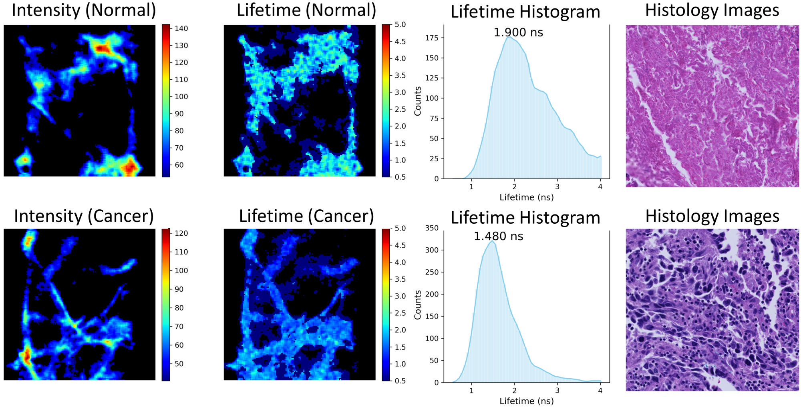
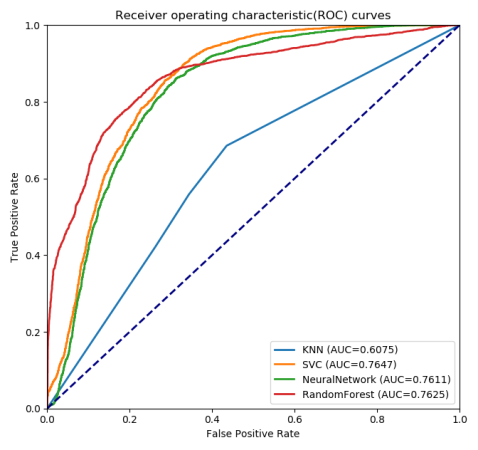
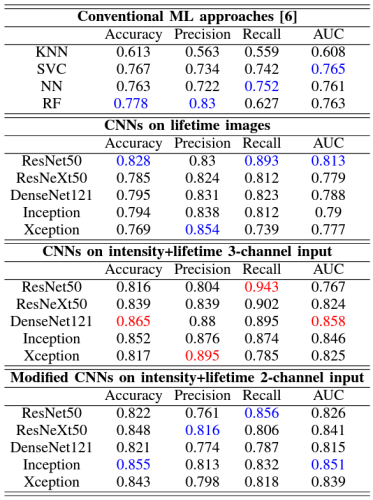

# Introduction
This repository is to introduce the investigations on lung cancer diagnosis using autofluorescence lifetime microscopic images with machine/deep learning technologies, which were done by the researchers at the University of Edinburgh and the Heriot-Watt University.  

# Fluorescence lifetime microscopic images

*Fig. 1: Lifetime contrast of non-cancerous (row 1) and cancerous (row 2) lung tissue using histograms (column 3) of lifetime images (column 2) obtained from intensity images (column 1), along with histological images (column 4) as the ground truth [1].*

Fluorescence lifetime is characterized by a decay from the excited state to the ground state and reveals unique characteristics of endogenous fluorescence in biological samples, which is independent of fluorescence concentration but sensitive to the biological environment. Fluorescence lifetime imaging endo/microscopy (FLIM) can utilise lifetime contrast between healthy/unhealthy biological tissue. Fig. 1 demonstrates an example of lifetime contrast between healthy and cancerous tissue, where averaged lifetime is derived by histogramming lifetime images.

# Machine learning-based classification

*Fig. 2: ROC curves and AUC scores reached by the ML techniques on the testing datasets [2]*

This study is a feasibility investigation of applying ML technologies to FLIM images for lung cancer diagnosis [2]. Over 20,000 FLIM images were collected from 10 pairs of ex-vivo lung tissue. Five ML technologies, namely k-nearest neighbourgh, support-vector machine, arteficial neural networks, and random forest, were trained with 10-folder cross-validation on the images from nine patients, and evaluated on the images from the remaining patients as an independent test set. Fig. 2 shows the ROC curves and AUC scores by the ML models.

The significance of the investigation is that lifetime values in the images can be directly utilised as the input features, rather than handcrafted features proposed in the existing studies, with promising results.

# Deep learning-based classification
## Conventional CNN models

*Table 1: Performance comparison of the CNN models for the classification. [3]*

The purpose of this study is to investigate the application of DL technologies for FLIM-based lung cancer classification. Five CNN models, namely, ResNet50, ResNeXt50, DenseNet121, Inception, and Xception, were applied to about 70,000 FLIM images from 14 patients for the discrimination. The results are listed in Table 1, which answer three critical questions not yet answered previously:
* The selected CNNs, with no doubt, outperform the ML algorithms on FLIM images for the classification; 
* The CNNs with lifetime images only are inferior to those with the combination of intensity and lifetime images, although the former are slightly better than the latter with two-channel intensity and lifetime input in precision and recall; and 
* The CNNs with three-channel intensity and lifetime images are superior to those with two-channel input, even though they are comparable in accuracy and AUC.

# References
1. Wang, Qiang, James R. Hopgood, Neil Finlayson, Gareth OS Williams, Susan Fernandes, Elvira Williams, Ahsan Akram, Kevin Dhaliwal, and Marta Vallejo. "Deep Learning in ex-vivo Lung Cancer Discrimination using Fluorescence Lifetime Endomicroscopic Images." In 2020 42nd Annual International Conference of the IEEE Engineering in Medicine & Biology Society (EMBC), pp. 1891-1894. IEEE, 2020.
2. Wang, Qiang; Vallejo, Marta; Hopgood, James. "Fluorescence Lifetime Endomicroscopic Image-based ex-vivo Human Lung Cancer Differentiation Using Machine Learning." TechRxiv. Preprint, Jan 2020. DOI: 10.36227/techrxiv.11535708.v1
3. Wang, Q, Hopgood, J, Finlayson, N, Williams, GOS, Fernandes, S, Williams, E, Akram, A, Dhaliwal, K  & Vallejo, M.  "Deep Learning in ex-vivo Lung Cancer Discrimination using Fluorescence Lifetime Endomicroscopic Images". in  42nd Annual International Conferences of the IEEE Engineering in Medicine and Biology Society. Québec, Quebec, Canada,  20/07/20. DOI: 10.1109/EMBC44109.2020.9175598