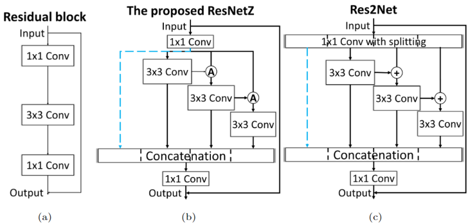
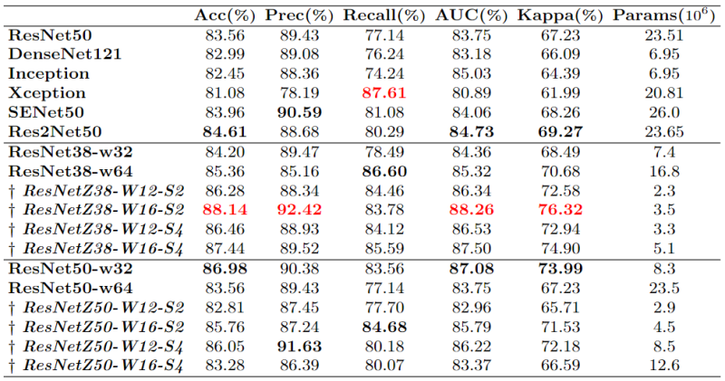

# Introduction
This repository is to brief the investigations on lung cancer diagnosis using autofluorescence lifetime microscopic images with machine/deep learning technologies, which were done by the researchers at the University of Edinburgh and the Heriot-Watt University. In the meantime, it is also to introduce the unique dataset containing 100,000 dual-band FLIM images collected on ex-vivo human lung tissue.

# Fluorescence lifetime microscopic images

*Fig. 1: Lifetime contrast of non-cancerous (row 1) and cancerous (row 2) lung tissue using histograms (column 3) of lifetime images (column 2) obtained from intensity images (column 1), along with histological images (column 4) as the ground truth [1].*

Fluorescence lifetime is characterized by a decay from the excited state to the ground state and reveals unique characteristics of endogenous fluorescence in biological samples, which is independent of fluorescence concentration but sensitive to the biological environment. Fluorescence lifetime imaging endo/microscopy (FLIM) can utilise lifetime contrast between healthy/unhealthy biological tissue. Fig. 1 demonstrates an example of lifetime contrast between healthy and cancerous tissue, where averaged lifetime is derived by histogramming lifetime images.

# The dataset
So far, 21 pairs of ex-vivo hunman lung have been examined and numerous dual-band FLIM images have been collected, containing over 100,000 FLIM images. The overall information of the dataset is listed in the below table. Note that it is slighly different from Table 1 in [3] as more data from 3 patients has been added. Note that since the collection is still ongoing, more data will be added over time. 

The FLIM dataset is available on [Edinburgh DataShare](https://datashare.ed.ac.uk/). If you find this dataset is helpful, please cite:
> Qiang Wang, James R. Hopgood, Susan Fernandes, Neil Finlayson, Gareth OS Williams, Ahsan Akram, Kevin Dhaliwal, and Marta Vallejo. "A Layer-Level Multi-Scale Architecture for Lung Cancer Classification with Fluorescence Lifetime Imaging Endomicroscopy". Neural Computing and Applications. 2021. Under review.

|    **Patient #**|  **# Cancer**| **# Normal**  |
|-----|-----|-----|
|20181023_lungtissue_normal_cancer_CR34|904|1712|
|20181026_LungTissue_Normal_Cancer_CR35|168|348|
|20181031_lungtissue_normal_cancer_CR36|840|2520|
|20181108_LungTissue_Normal_Cancer_CR38|260|280|
|20181112_Lungtissue_normal_cancer_CR39|40|360|
|20181115_lungtissue_normal_cancer_CR41|880|1300|
|20181123_lungtissue_normal_cancer_CR42|1080|1320|
|20181218_LungTissue_Normal_Cancer_CR44|0|2400|
|20190110_LungTissue_Normal_Cancer_CR46|792|1186|
|20190116_15_25_17_CR48|396|396|
|20190129_10_51_20_CR49|1196|1994|
|20190130_11_52_51_CR50|1196|1202|
|20190201_14_19_46_CR51|598|2790|
|20190208_13_18_07_CR52|1200|1200|
|20190220_10_34_46_CR53|1698|200|
|20190227_13_55_13_CR54|992|894|
|20190305_13_51_46_Cr55|140|180|
|20190306_11_19_41_Cr56|280|120|
|20190307_14_32_11_CR57|240|180|
|20190311_14_25_39_cr58|126|120|
|20190311_14_25_39_cr59|128|140|
| **Total** | **13154**| **20842**|

# Machine learning-based classification

*Fig. 2: ROC curves and AUC scores reached by the ML techniques on the testing datasets [2]*

This study is a feasibility investigation of applying ML technologies to FLIM images for lung cancer diagnosis [2]. Over 20,000 FLIM images were collected from 10 pairs of ex-vivo lung tissue. Five ML technologies, namely k-nearest neighbourgh, support-vector machine, arteficial neural networks, and random forest, were trained with 10-folder cross-validation on the images from nine patients, and evaluated on the images from the remaining patients as an independent test set. Fig. 2 shows the ROC curves and AUC scores by the ML models.

The significance of the investigation is that lifetime values in the images can be directly utilised as the input features, rather than handcrafted features proposed in the existing studies, with promising results.

# Deep learning-based classification
## Conventional CNN models

*Table 1: Performance comparison of the CNN models for the classification. [1]*

The purpose of this study is to investigate the application of DL technologies for FLIM-based lung cancer classification. Five CNN models, namely, ResNet50, ResNeXt50, DenseNet121, Inception, and Xception, were applied to about 70,000 FLIM images from 14 patients for the discrimination. The results are listed in Table 1, which answer three critical questions not yet answered previously:
* The selected CNNs, with no doubt, outperform the ML algorithms on FLIM images for the classification; 
* The CNNs with lifetime images only are inferior to those with the combination of intensity and lifetime images, although the former are slightly better than the latter with two-channel intensity and lifetime input in precision and recall; and 
* The CNNs with three-channel intensity and lifetime images are superior to those with two-channel input, even though they are comparable in accuracy and AUC.

## Multi-scale CNN models

*Fig. 3: (A) original residual block in ResNet, (b) proposed ResNetZ module, and (c) Res2Net module as a feature-level multi-scale example. Both ResNetZ and Res2Net blocks contain a shortcut connection (the leftmost blue dash line). [3]*

*Table 2: Performance comparison of the backbone ResNet, ResNetZ, and three variations of ResNet family. The best scores of each group are in bold, and the overall best scores are highlighted in red. [3]*

To achieve better performance but less parameters, we proposed layer-level multi-scale architectures for our purposes, which integrated the advantages of layer-level, 
such as Inception, and feature-level, such as Res2Net, architectures. Fig. 3.b shows the structure of the proposed model. Unlike Res2Net (Fig. 3.c) which performs group 
convolution on the input features after 1x1 convolution, our model treats the input features as a whole to retain the global information. A direct advantage is our model 
requires less parameters than Res2Net, and the difference increase significantly when the number of branch covolutions is significant. Meanwhile, we applied different 
operations for aggregating local information from previous branch and global information (the input features), including *Addition* used in Res2Net and *Concatenation*. In addition, we also utilised dilated convolutions to further enlarge the receptive fields. 

The results in [3-5] demonstrated that our model outperformed conventional CNN models but with substantially less parameters. In addition, we also illustrated the pros and cons of layer- and feature-level multi-scale architectures for the classification. Meanwhile, we showed that using intensity-weighted lifetime images as the input can achieve better predictions than other formats proposed [5].

# References
1. Qiang Wang, James R. Hopgood, Neil Finlayson, Gareth OS Williams, Susan Fernandes, Elvira Williams, Ahsan Akram, Kevin Dhaliwal, and Marta Vallejo. "Deep Learning in ex-vivo Lung Cancer Discrimination using Fluorescence Lifetime Endomicroscopic Images". in  42nd Annual International Conferences of the IEEE Engineering in Medicine and Biology Society. Québec, Quebec, Canada,  20/07/20. https://doi.org/10.1109/EMBC44109.2020.9175598
2. Qiang Wang; Marta Vallejo; James R. Hopgood. "Fluorescence Lifetime Endomicroscopic Image-based ex-vivo Human Lung Cancer Differentiation Using Machine Learning." TechRxiv. Preprint, Jan 2020. https://doi.org/10.36227/techrxiv.11535708.v1
3. Qiang Wang, James R. Hopgood, Susan Fernandes, Neil Finlayson, Gareth OS Williams, Ahsan Akram, Kevin Dhaliwal, and Marta Vallejo. "A Layer-Level Multi-Scale Architecture for Lung Cancer Classification with Fluorescence Lifetime Imaging Endomicroscopy". Neural Computing and Applications. 2021. Under review.
4. Qiang Wang, James R. Hopgood, Marta Vallejo, "Fluorescence lifetime imaging endomicroscopy-based ex-vivo lung cancer prediction using multi-scale concatenated-dilation convolutional neural networks," Proc. SPIE 11597, Medical Imaging 2021: Computer-Aided Diagnosis, 115972O (15 February 2021); https://doi.org/10.1117/12.2580467
5. Qiang Wang, James R. Hopgood, Marta Vallejo, "Multi-Scale Aggregated-Dilation Network for ex-vivo Lung Cancer Detection with Fluorescence Lifetime Imaging Endomicroscopy," 2021 43rd Annual International Conference of the IEEE Engineering in Medicine & Biology Society (EMBC), 2021, pp. 2918-2922, doi: 10.1109/EMBC46164.2021.9630836.